# MI

## 需求实现
* 首页（index）
  + 轮播
  + 选项卡
  + 搜索框
  + 二级菜单
* 列表页（list）
  + 分页器分页
  + 列表渲染
  + 筛选
  + 排序
* 详情页（detail）
  + 放大镜
* 登录页（login）
  + 账号登录
  + 扫码登录
* 注册页（register）
  + 注册账号

## 技术
* html
* css
* JavaScript
* jQuery
* php

## 服务器
* Apache
* 域名：www.xiaomi.com

## 数据库
* MySQL
* 数据库文件
  + database ： mi
  + table ：
    - user ：用户表
    - xiaomi_table ：商品详情表

## 代理
* jsonp：搜索框使用

## 文件
* assets：第三方
* css：
  + fontfamily.css 字体文件
* images：项目用的图片
* img：本文件用的图片
* js：
  + common.js 公共事件
  + public.js 封装的函数
  + text.js 数据文件
* sever：
  + common.php 公共请求

## 页面联动
* 首页
  >www.xiaomi.com 进入 **首页**
  >头部黑色导航条 `小米商城` 按钮可以跳转  **列表页**
  >头部黑色导航条 `登录` 按钮可以跳转  **登录页**
  >头部黑色导航条 `注册` 按钮可以跳转  **注册页**
  >头部白色导航条 `logo` 图片可以跳转 **首页**
  >头部头部白色导航条 一级菜单 下的 `二级菜单` 可以跳转 **详情页**
  >banner区轮播图左边的菜单 `一级菜单` 点击可以跳转 **列表页**
  >主体部分的每个小区块标题栏右侧 `查看全部` 可以跳转 **列表页**  

* 列表页
  >主体部分商品列表内所有 `商品` 点击可以跳转 **详情页**
  >头部白色导航条 `logo` 图片可以跳转 **首页**

* 详情页
  >部白色导航条 `logo` 图片可以跳转 **首页**
  >查看的商品不存在可以跳转回 **列表页**

* 登录页
  >登录成功跳转**首页**
  >头部 `logo` 点击跳转**首页**

* 注册页
  >注册成功跳转**登录页**
  >头部 `logo` 点击跳转**首页**

## 功能实现
* 首页
  + 头部黑色导航条 `购物车` 移入显示移出隐藏
  + 头部白色导航条 `一级菜单` 移入显示二级菜单 移出收起二级菜单
  + 头部白色导航条 `搜索框` 点击内部聚焦 点击外部失焦
  + 头部白色导航条 `搜索框` 输如内容时实时搜索
  + banner部分左边 `一级菜单` 移入显示二级菜单 移出收起二级菜单
  + banner部分左边一级菜单展开的 `二级菜单` 请求数据库数据渲染
  + banner部分 `轮播图`
  + 小米闪购部分 `倒计时`
  + 小米闪购部分 `轮播图`
  + 主体部分 每个`商品类目模块` 请求数据库数据渲染
  + 底部 `微信` 移入显示移出隐藏
  + 侧边工具栏 `回到顶部` 页面滚动到300px 以上出现 300px以下消失
  + 侧边工具栏 `回到顶部` 点击回到页面顶部
* 列表页
  + 头部白色导航条 `商品分类` 移入显示商品分类菜单 （二级菜单）
  + 头部白色导航条其他所有功能均与首页一样可以实现
  + 头部白色导航条 `商品分类`一级菜单 点击可以进行筛选（显示该分类的所有商品）
  + `分页器`
  + 主体部分 `所有商品` 请求数据库数据渲染
  + 页面右侧 `价格排序` 点击进行商品价格升序降序排序
* 详情页
  + 头部白色导航条所有功能均与首页一样可以实现
  + 导航条下方粘性定位 `导航条` 请求数据库数据渲染
  + 主体部分 左侧`商品图片` 和 右侧`商品信息` 均为请求数据库数据渲染
  + 主体部分商品图片 `放大镜`
* 登录页
  + 账号登录 登录验证
  + 扫码登录
* 注册页
  + 注册账号

## 运行图示

#### 首页
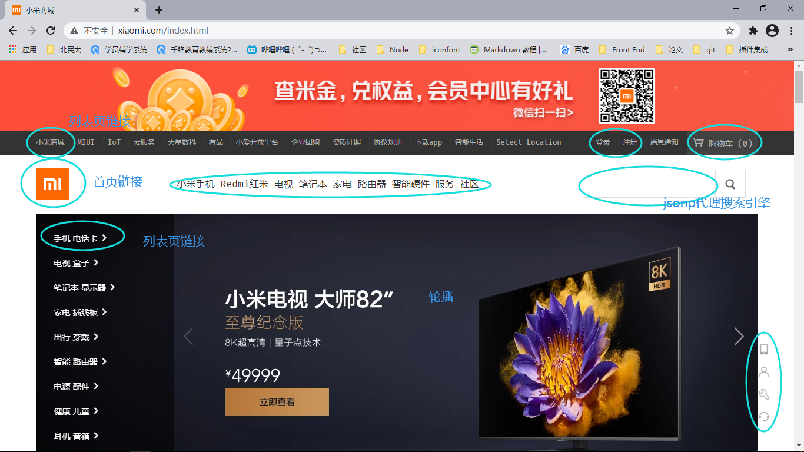

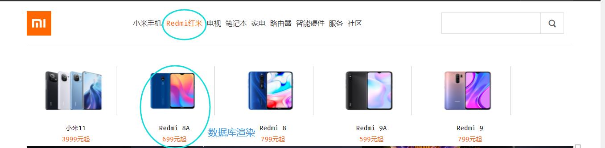

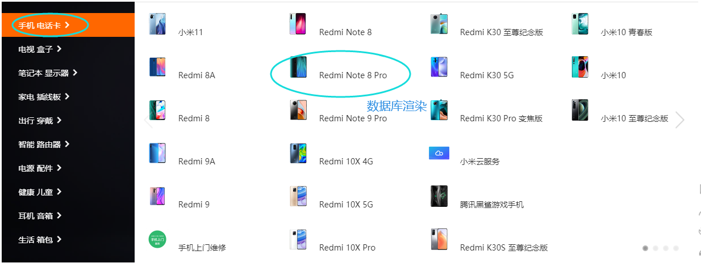

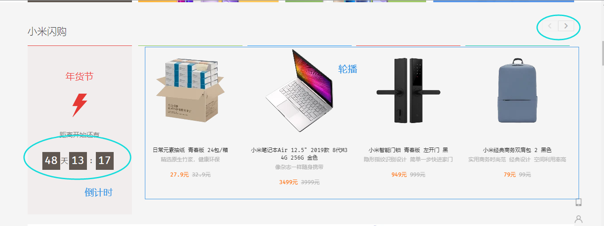

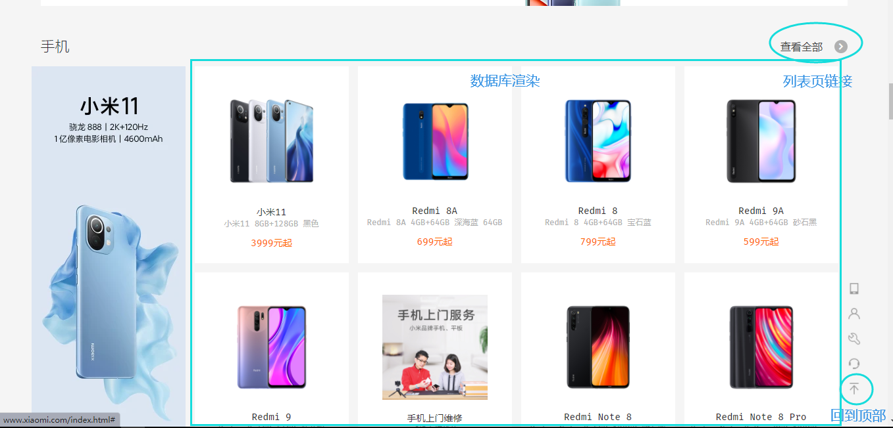

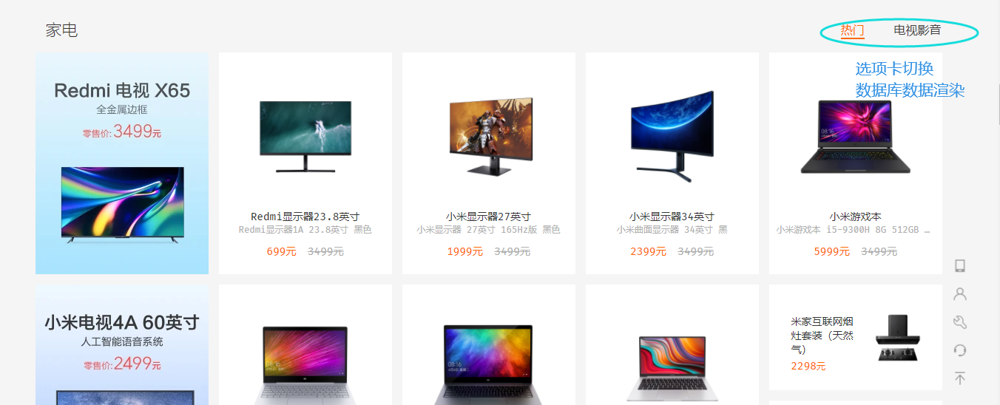

#### 列表页
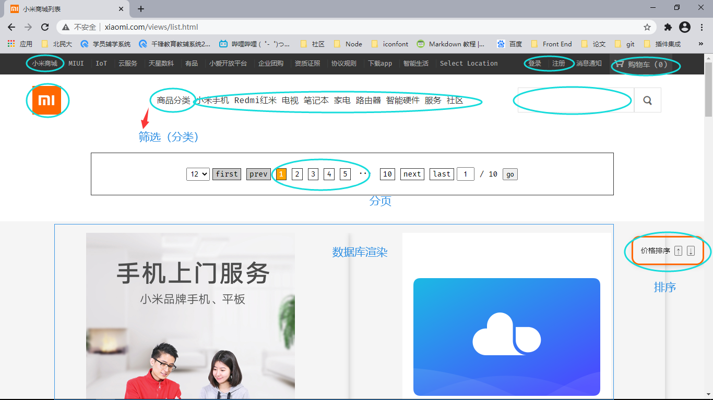

#### 详情页
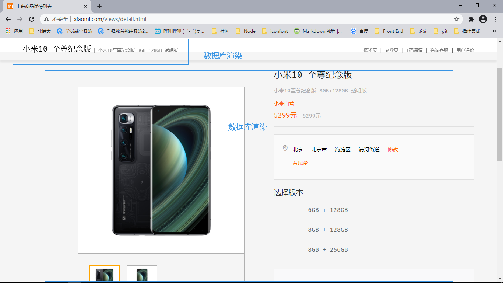

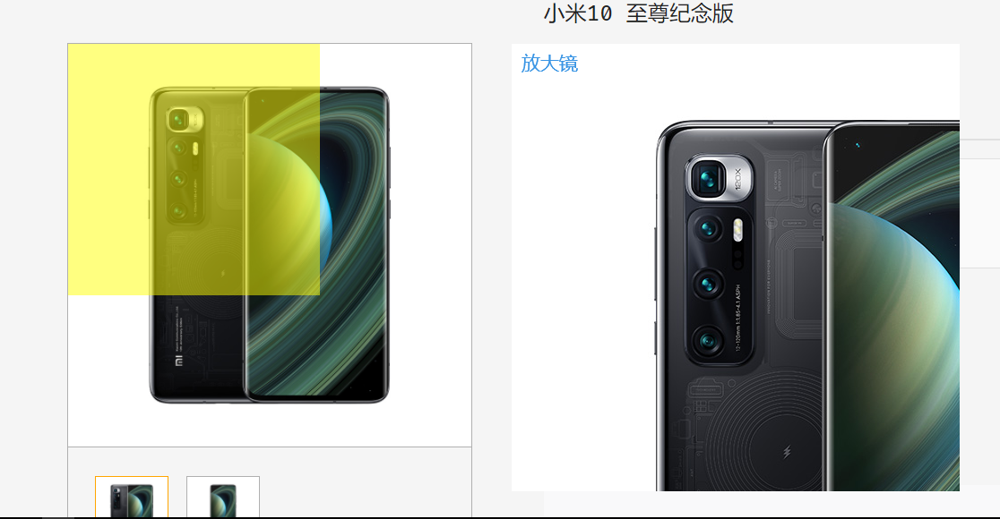

#### 登录页
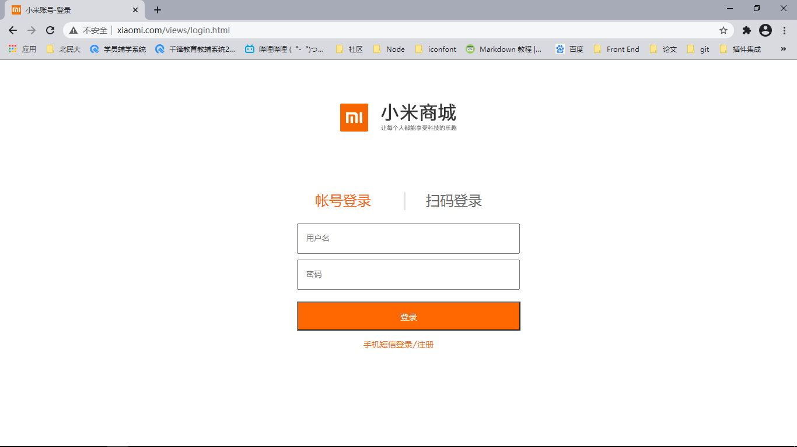

#### 注册页
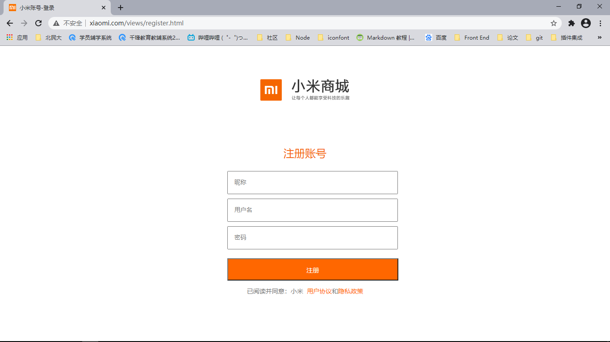

